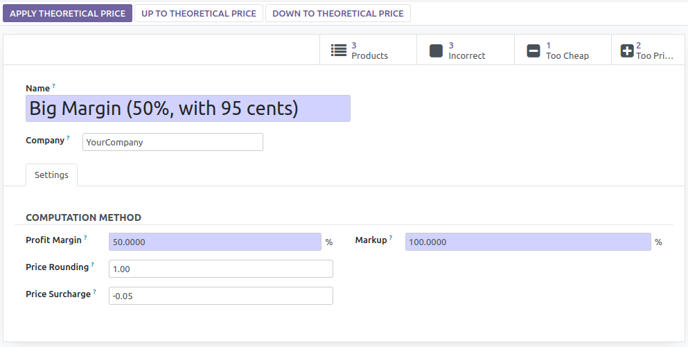
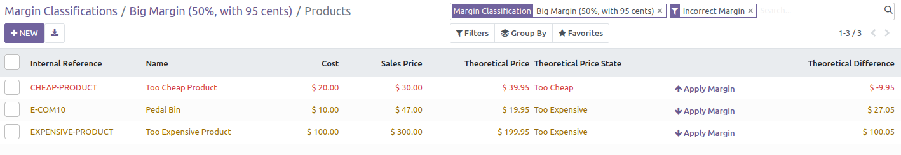
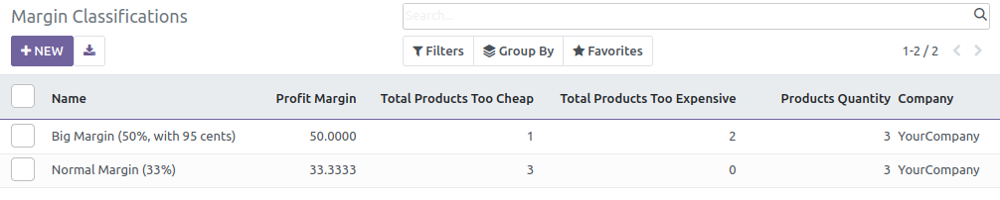

* Go to : 'Sale > Configuration > Products > Margin Classifications
* Create new classifications
* Set classification to your products

On the Margin classification Form, user can change computation fields.
(Margin, Rounding method, ...)
Three buttons are available to apply theoretical prices:
* to all products,
* only for products that are too expensive
* only for products that are too cheap

By clicking on the smart buttons on the right part of the form,
all the products will be displayed, and user can easily change prices

User can also see easily products with incorrect margins in the margin classification tree views:

