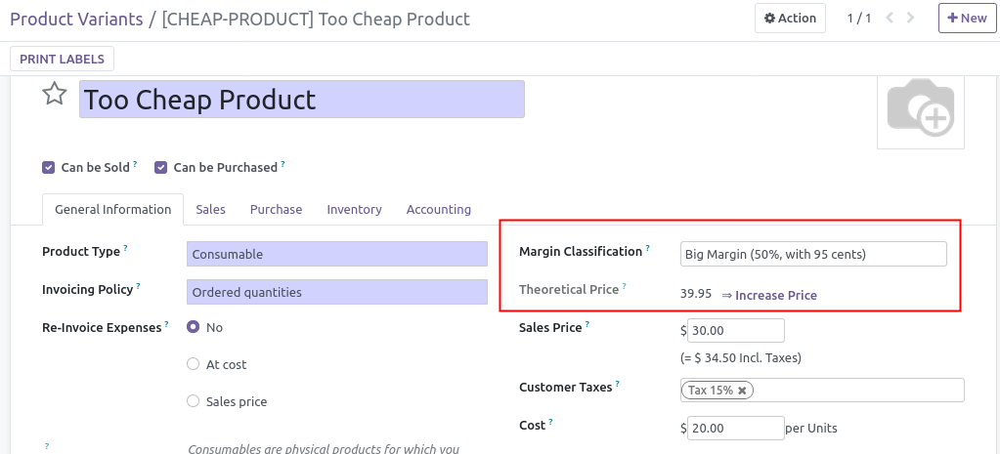

If product has a margin classification defined and the theoretical price is
not the same as the sale price, an extra field 'Theoretical Price' is
displayed, based on the Margin Classification and a button is available to
change sale price.

