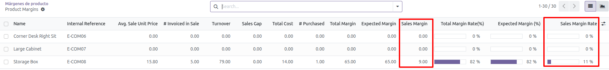
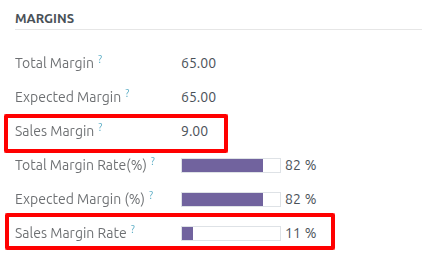

Sales margin fields
------------------

1. Go to *Invoicing* > *Reporting* -> Product Margins
2. Select the values you want to filter by.
3. Click on the *Open margins* button.
4. When the new view is displayed, the two new fields are visible; similarly,
   if you select an element, they will be visible in the form view.

     

     

Field calculations
------------------
* Sales margin = Turnover - (# Invoiced in Sale * Avg. Unit Price [Purchases])
* Sales margin rate = (Sales margin - * 100) / Turnover

