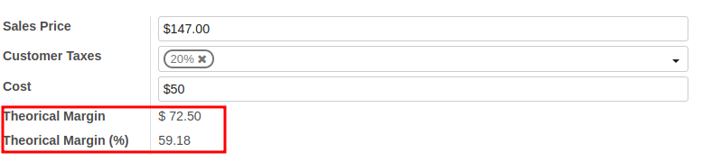

Add a field on the product form that compute the standard (or theorical)
margin based on the current values of sale and standard price present in
the product form. We take care of taxe included or excluded.

It will just compute it as follow:
(Sale Price without tax - Standard Price) / Sale Price without tax

**Note:**

As this module will base his simple computation on sale and cost prices,
it suppose you have them both in the same currency (the price type must of
the same currency for both of them). Remember this is the default OpenERP
configuration (price type of all product price fields are set as the same as
the company currency). We don't take care of it cause otherwise we should
have added a dependency on sale module.
