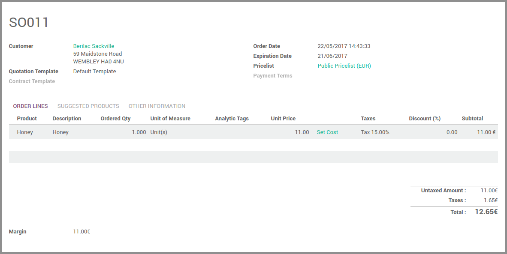
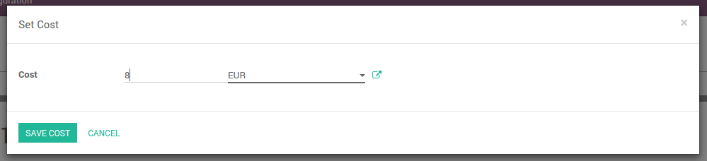

.. image:: https://img.shields.io/badge/licence-AGPL--3-blue.svg
   :target: http://www.gnu.org/licenses/agpl-3.0-standalone.html
   :alt: License: AGPL-3

=======================
Sale Lines Cost Control
=======================

This modules modifies the visibility of the Cost prices on Sales Order lines.
Specifically, it:

* hides the cost price on lines for normal users
* add a new group allowing to see the cost price on lines
* add a new button on lines without cost to set the current price

It allows to correct the cost of new products when users should not have
the permission to see the cost price.

Configuration
=============

No configuration is needed.
Users that must see the cost prices must have the "Cost Prices in Sales Orders"
group. This group can be added as inherited group in a more general group such
as "Sales / Manager".

Usage
=====

The sales order view has been modified according to the description above.
There is no special usage.

.. image:: https://odoo-community.org/website/image/ir.attachment/5784_f2813bd/datas
   :alt: Try me on Runbot
   :target: https://runbot.odoo-community.org/runbot/132/10.0

Known issues / Roadmap
======================

* No plans at the moment

Bug Tracker
===========

Bugs are tracked on `GitHub Issues
<https://github.com/OCA/margin-analysis/issues>`_. In case of trouble, please
check there if your issue has already been reported. If you spotted it first,
help us smash it by providing detailed and welcomed feedback.

Credits
=======

Images
------

* Odoo Community Association: `Icon <https://github.com/OCA/maintainer-tools/blob/master/template/module/static/description/icon.svg>`_.

Contributors
------------

* Guewen Baconnier <guewen.baconnier@camptocamp.com>

Maintainer
----------

.. image:: https://odoo-community.org/logo.png
   :alt: Odoo Community Association
   :target: https://odoo-community.org

This module is maintained by the OCA.

OCA, or the Odoo Community Association, is a nonprofit organization whose
mission is to support the collaborative development of Odoo features and
promote its widespread use.

To contribute to this module, please visit https://odoo-community.org.
